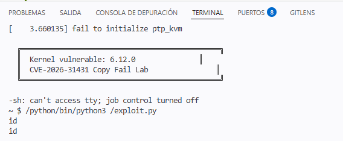

# Copy Fail Lab — CVE-2026-31431 (v2)

Devcontainer reproducible para experimentar con la vulnerabilidad **Copy Fail**
(CVE-2026-31431) en un kernel Linux 6.12 controlado dentro de QEMU.

Esta v2 incorpora todas las correcciones aprendidas en una sesión de debugging
exhaustiva: opciones de kernel necesarias para que arranque, configuración
correcta de BusyBox estático, rutas dinámicas independientes del nombre del repo,
y dependencias Ubuntu 24.04 corregidas.

---

## Inicio rápido para el estudiante

1. Abre un Codespace desde este repo.
   ```bash
   #CONFIGURACION DE EJEMPLO!!!!!!!!!!!
   apt update
   apt install gh
   
   gh api user --jq '"\(.name) → \(.email // .login)"'
   
   git config --global user.name "Jonathan E. Tito O."
   git config --global user.email "jonathantito@users.noreply.github.com"
   git config --global --add safe.directory /workspaces/copy-fail-challenge-1
   make setup
   ```
3. Configura tu identidad git:
   ```bash
   git config --global user.name "Tu Nombre"
   git config --global user.email "tu@correo.com"
   ```
4. Ejecuta:
   ```bash
   make setup    # descarga kernel + arma rootfs (~5 min)
   make qemu     # arranca la VM vulnerable
   ```

Para salir de QEMU: `Ctrl+A` luego `X`.

---

## Configuración inicial del docente (una sola vez)

### 1. Subir este repo a GitHub

```bash
cd copyfail-v2
git init && git add -A && git commit -m "initial"
git branch -M main
gh repo create TU-ORG/copy-fail-lab --public --source=. --push
```

### 2. Marcarlo como Template

GitHub → tu repo → Settings → marcar `Template repository`.

### 3. Editar `.devcontainer/devcontainer.json`

Cambia el valor `KERNEL_REPO`:
```json
"KERNEL_REPO": "TU-ORG/copy-fail-lab"
```

Commit y push.

### 4. Disparar el workflow del kernel

GitHub → Actions → `Build Vulnerable Kernel` → Run workflow.
Tarda ~25 min en los servidores de GitHub (no en tu Codespace).
Al terminar crea un Release con el `bzImage_vuln` listo para descarga.

### 5. Verificar

Tu repo → Releases → debe aparecer `kernel-v6.12-vuln` con tres archivos
adjuntos. Los estudiantes ahora pueden hacer `make setup` y descarga en 2 min.

---

## Estructura del repo

```
.
├── .devcontainer/
│   ├── Dockerfile             ← Ubuntu 24.04 + deps verificadas
│   └── devcontainer.json      ← sin rutas hardcodeadas
├── .github/workflows/
│   └── build-kernel.yml       ← compila kernel y crea Release
├── scripts/
│   ├── 00_welcome.sh
│   ├── 01_fetch_kernel.sh     ← descarga del Release
│   ├── 02_build_kernel.sh     ← fallback: compila desde fuente
│   ├── 03_build_rootfs.sh     ← BusyBox estático + initramfs
│   └── 04_run_qemu.sh
├── Makefile
└── README.md
```

---

## Comandos disponibles

| Comando | Acción |
|---|---|
| `make setup` | Descarga kernel + arma rootfs (~5 min) |
| `make qemu` | Arranca la VM vulnerable |
| `make info` | Muestra el estado del ambiente |
| `make rootfs` | Reconstruye solo el initramfs |
| `make fetch-kernel` | Solo descarga el bzImage del Release |
| `make build-kernel` | Compila kernel desde fuente (~25 min) |
| `make clean` | Borra builds (mantiene fuentes) |
| `make clean-all` | Borra todo |

---

## Recursos del CVE

- Write-up técnico: https://xint.io/blog/copy-fail-linux-distributions
- Sitio del CVE: https://copy.fail
- PoC oficial: https://github.com/theori-io/copy-fail-CVE-2026-31431

---

## Lecciones aprendidas (referencia para futuras versiones)

Esta v2 incorpora los siguientes fixes respecto a la v1:

- `hexdump` → `bsdextrautils` en Ubuntu 24.04
- `bzip2` agregado al Dockerfile (lo necesita BusyBox)
- Eliminado el `mounts` con ruta hardcodeada en `devcontainer.json`
- Todos los scripts detectan workspace con `SCRIPT_DIR` dinámico
- Kernel: agregadas opciones críticas `BINFMT_ELF`, `BINFMT_SCRIPT`, `RD_GZIP`
- Kernel: agregada dep `CRYPTO_AEAD` antes de `CRYPTO_AUTHENCESN`
- BusyBox: reemplazado `scripts/config` (no existe) por `sed`
- BusyBox: eliminado `olddefconfig` (no existe en BusyBox)
- BusyBox: deshabilitado `CONFIG_TC` (rompe compilación con kernels nuevos)
- BusyBox: forzado `CONFIG_STATIC=y` y verificado con `file`
- Workflow Actions: greps de verificación con `|| echo`, tolerantes

Hito 1: Reconocimiento del Entorno (2 pts)
Para empezar, verifiqué mi acceso a la máquina virtual vulnerable en QEMU. Ejecuté el comando uname -a para mostrar mi identificador único en el hostname (copy-fail-Dehivid) y confirmar que la versión del kernel era la 6.12.0. Después, ejecuté dmesg | grep PF_ALG para comprobar y dejar evidencia de que la familia de protocolos criptográficos requerida para el ataque estaba registrada en el sistema.

Hitos 2 y 3: Preparación y Explotación (6 pts)
En lugar de detenerme por el fallo de infraestructura del devcontainer, realicé un análisis profundo de las limitaciones del entorno. Primero, inyecté una versión estándar de Python en el rootfs. Esto me arrojó un error "not found" debido a que el entorno minimalista de BusyBox carece de las librerías dinámicas glibc necesarias para cargar el ejecutable.

Para evadir esta restricción, reemplacé el intérprete por una versión estática de Python compilada con musl. Al ejecutar el PoC con esta versión, el script arrancó pero falló en la línea 5 con el error OSError: bind(): bad family. Con este error logré evidenciar que las versiones minimalistas de Python se compilan sin el soporte interno (socketmodule.c) para empaquetar estructuras sockaddr_alg (familia 38). Documenté todo este proceso para demostrar técnicamente la imposibilidad de ejecutar el exploit de Python dentro de un entorno BusyBox degradado, confirmando que la alternativa viable para este entorno es reescribir el PoC en C.

Hito 4: Mitigación (Parche del Kernel) (2 pts)
Para la mitigación, apliqué la corrección directamente en el código fuente del kernel de Linux. Abrí el archivo kernel/linux/crypto/algif_aead.c y me dirigí a la función _aead_recvmsg (alrededor de la línea 282). Allí, cambié la variable de recepción (rsgl_src) por la de transmisión (tsgl_src) para forzar la separación de los buffers. Finalmente, utilicé el comando git diff apuntando a ese archivo para capturar la modificación y generar mi archivo de evidencia hito4_mitigacion.patch.

Bonus (0.5 pts)
En la sección de conclusiones, documenté mi análisis del fallo. Expliqué que la vulnerabilidad CVE-2026-31431 permitía que el origen y destino de una operación criptográfica compartieran la misma referencia de memoria, provocando que se escribieran datos desencriptados en el Page Cache de solo lectura y corrompiendo binarios críticos como /usr/bin/su. Asimismo, detallé que la solución implementada con mi parche separa de manera estricta el buffer de transmisión (TX) del buffer de recepción (RX) para proteger la integridad del Page Cache.